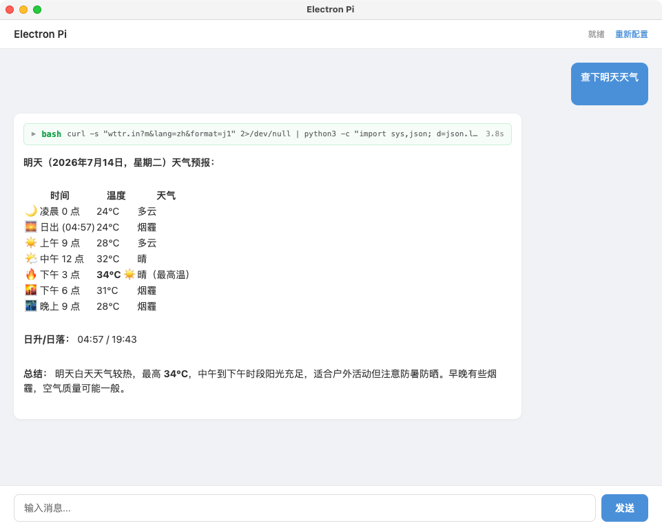
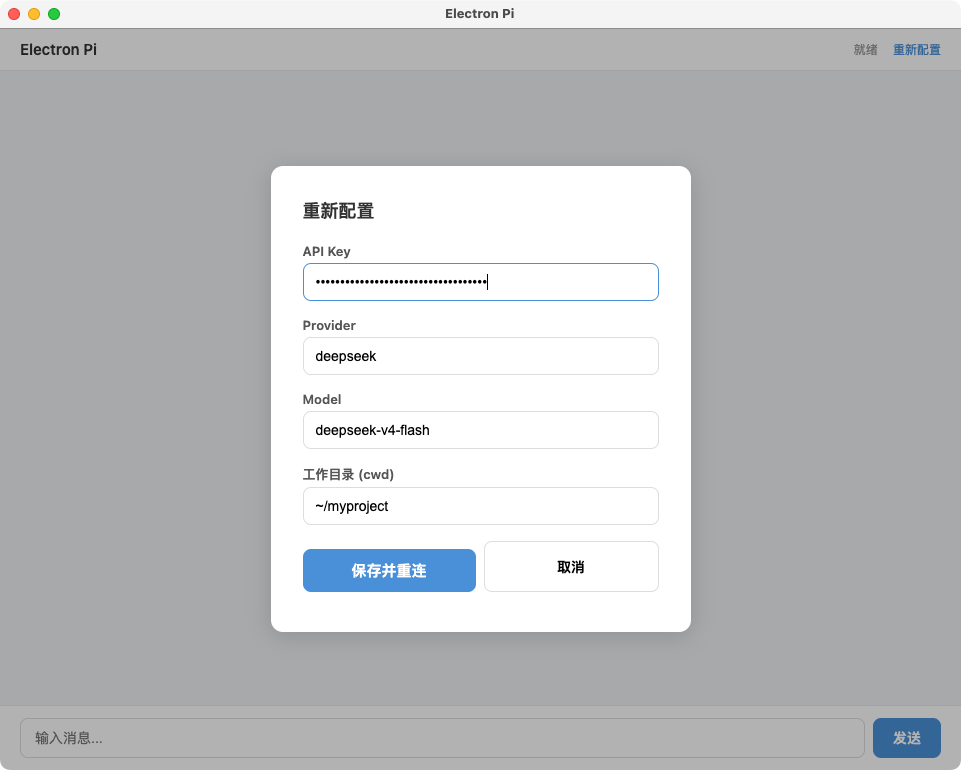

# Electron PI

Electron 桌面应用，集成 PI Coding Agent SDK，提供跨平台 AI 聊天界面。

## 截图

### 聊天界面


### 设置界面


## 功能特性

- 集成 PI Coding Agent SDK，支持 tool calling（bash、read、edit、write、grep、find）
- 流式回复渲染
- 工具调用可视化（可折叠、显示参数/结果/耗时）
- Markdown 渲染（本地引入 marked.js）
- 多 Provider 支持（DeepSeek 等）
- 模态对话框重新配置，无需重启

## 架构

```
Renderer (index.html)
    ↕ contextBridge (preload.js)
Main Process (main.js)
    ↕ @earendil-works/pi-coding-agent
AgentSession (Tool calling, LLM 通信)
```

## 技术栈

- Electron 43
- @earendil-works/pi-coding-agent 0.80
- marked.js（本地引入）

## 快速开始

```bash
# 1. 安装依赖
npm install

# 2. 复制配置模板
cp config.example.json config.json
# 编辑 config.json 填入 API Key

# 3. 启动开发模式
npm start
```

## 构建

### macOS

```bash
npm run build:mac
# 输出 release/ElectronPi-1.0.0.dmg
```

无签名时首次打开需右键 → 打开，或：

```bash
xattr -cr /Applications/ElectronPi.app
```

### Windows

```bash
ELECTRON_MIRROR=https://npmmirror.com/mirrors/electron/ npx electron-builder --win
# 输出 release/ElectronPi 1.0.0.exe
```

Portable 单文件，免安装。无签名时 SmartScreen 拦截，点"更多信息 → 仍要运行"。

## 配置

开发模式：`./config.json`
生产模式：`~/.electron-proto/config.json`

```json
{
  "provider": "deepseek",
  "model": "deepseek-v4-flash",
  "apiKey": "sk-xxx",
  "cwd": "~/project"
}
```

## 关键文件

| 文件 | 说明 |
|---|---|
| `src/main.js` | 主进程：窗口管理、PI SDK、IPC 通道 |
| `src/preload.js` | contextBridge 暴露 `window.pi.*` API |
| `src/index.html` | 渲染层：设置表单 + 聊天界面 |
| `electron-builder.yml` | 跨平台构建配置 |
| `config.example.json` | 配置模板 |
| `src/vendor/marked.min.js` | 本地 Markdown 渲染库 |

## 许可证

MIT
